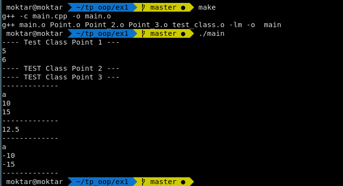

# TP OOP : 
Ce repertoire represente notre travail dans le TP OOP 
## TP-1   
- Point.cpp and Point.h: EX1 
- Point_2.cpp and Point_2.h: EX2

## TP-2 
- Point_3.cpp and Point_3.h: EX

## Execution and Testing 
- Testing 

On a creer un fichier main.cpp pour tester l'excution les Class 
- Execution

Dans le terminal: 

```bash  
$ make 
$ ./main
``` 


